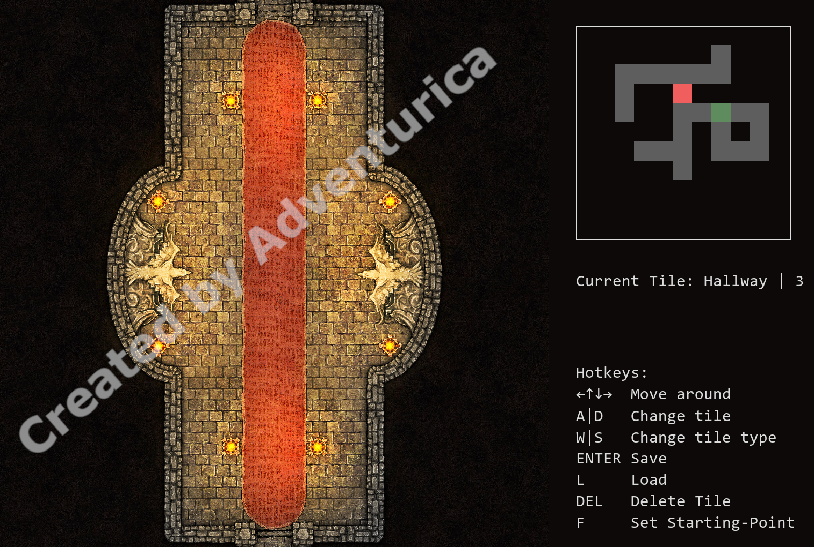

# DnDDungeonCrawler
Made in cooperation with my [friend](https://github.com/miki2017milan)
This little programm lets you create tilebased dungeons for your TTRPG.
I have used the Stone Assets of [Adventurica's](https://www.kickstarter.com/projects/840112518/dungeon-builders-toolkit-modular-maps-for-ttrpgs-and-dandd/creator_bio) [Dungeon Builders Toolkit](https://www.kickstarter.com/projects/840112518/dungeon-builders-toolkit-modular-maps-for-ttrpgs-and-dandd/description) but you can use any images you want, as long as they are in a 1:1 ratio ;)

## Features
There is a editmode with a minimap and some more info on how to use this programm. If you turn it off, the minimap and info will also disappear and the programm will start in fullscreen. If you are not in editmode, you can't move past existing tiles. In editmode to create a new tile, simply move to a free space. The red square on the minimap is you and the green one is your staring point which you can't delete but move wherever you want it. You can save and load your dungeons too!



## Installation Guide
### Dependencies
1. Install python from https://www.python.org/downloads/
2. Install pygame
```python
pip install pygame
```

### Asset Configuration
1. Create a folder named Tiles in the same folder as the .py files
2. Sort all images by how many entrances each tile has in different folders. E.g:
```
├───Tiles
│   ├───OneWay
│   ├───TwoWay
│   ├───ThreeWay
│   ├───FourWay
│   └───Hallway
```
3. Rename all files in each folder to a descending number.
```
├───OneWay
│   ├───1.jpg
│   ├───2.jpg
│   ...
├───TwoWay
│   ├───1.jpg
│   ├───2.jpg
...
```

### Config
The Config has comments which should explain everything ;)

## Starting Guide

1. To start the programm, you first have to open the Terminal
2. In the Terminal, change the directory to the folder where you have saved the Main.py, Config.py and Tiles folder. (Replace <path> with the path to your folder. E.g. C:\Users\KarliCarlos\Documents\DnDDungeonCrawler
```bash
cd <path>
```
3. Run Main.py
```bash
python Main.py
```

Have Fun!
